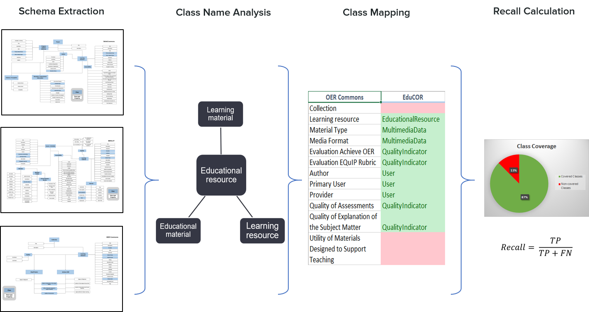
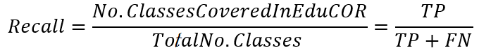
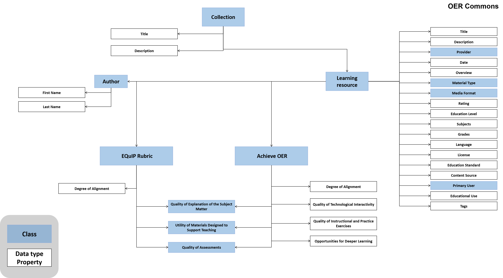
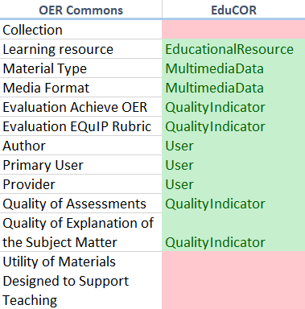

# Ontology mapping for gold standard evaluation

To measure EduCOR's coverage and adaptability towards other existing ontologies,
we select three well-established repositories for ER resources, namely
[Merlot](https://www.merlot.org/), [SkilsCommons](https://www.skillscommons.org/), and [OERCommons](https://www.oercommons.org/). The evaluation process is then conducted by mapping EduCOR classes to the underlying schema of each repository. Mapping refers to
identifying classes in the gold standards that classes in EduCOR can represent.

Four steps are required to conduct an objective mapping to the gold-standard schemas:
1. Schema extraction.
2. Class name analysis.
3. Class one-on-one mapping.
4. Coverage calculation through Recall

### 1. Schema extraction
Since the APIs of the selected repositories are not open, we conduct a thorough analysis of repositories' schemas based on the information on their websites, user guides, and the use of hosted materials and resources. We extract the overall class representations of the three schemas. We identify classes, object properties and data-type properties from those schemas to the best of our knowledge, in order to have a clear representation of the repository.

### 2. Class name analysis
Mapping is dependent on the clear definition of the schema's vocabulary. Different class names may be used by different repositories to express the came concept. Similarly, once class name can have different meanings in different repositories. Therefore, we analyze the extracted schemas and the meaning of their class names, to ensure the correctness in mapping those to EduCOR's classes. Understanding the meaning of a class name was accomplished on two levels: 1) analyzing the class functionality in the corresponding schema, which includes its connections to other classes and the individuals created from it. 2) conducting the analysis by multiple developers, to secure different perspectives and achieve a common understanding of the class meaning. 

### 3. Class one-on-one mapping
Once class meanings are decided, classes from the each repository are then mapped to EduCOR's classes one by one. With class mapping, we look for the classes in the gold standard schema, which are covered by a class in EduCOR. Since the final goals is to measure the coverage and adaptability, we focus on: 1) measuring how much EduCOR's classes cover the repository's classes, and 2) how much the same classes in EduCOR can represent classes from multiple other repositories.
Within this step of the mapping, we map the ontology classes only, not the data-type properties. This is because the actual types of these properties are not known from the chosen repositories, and since the attributes of the class can be extended as much as needed without affecting the meaning of the class or its function in the overall schema.

Having the classes mapped from EduCOR to each of the gold standard schemas, we can now measure coverage value numerically.

### 4. Coverage calculation through Recall
we follow the work of [Brewster et al.](https://eprints.soton.ac.uk/259062/) to calculate the Recall, as defined by the information-retrieval domain, to represent the coverage of EduCOR. 

In this adaption, we define the true positive value as the number of classes covered by EduCOR and existing in the gold schema, while the false negative is define by the number of classes in the schema that EduCOR did not cover. The calculated recall values indicated the ability of EduCOR ontology to represent data in the selected repositories with a high coverage level of more than 83%.

In the following sections, this mapping process is explained in details for each of the selected gold standard schemas.

## Mapping to MERLOT repository

MERLOT includes a rich representation of the ERs and OERs that are hosted in the repository. It shoes a noticeable focus on the OER meta-data, the accessibility of OERs and the user roles in the system.

Educational resources in MERLOT are described with the "Learning Materials" class. They are a part of a course, which is represented by the "Course e-Portfolio" class. Users in MERLOT have multiple roles, including students, administrators, teachers, etc. Some teaching roles have also the potential to offer consultation hours to students, which are represented in the schema by the "Virtual Speakers Bureau" class.

MERLOT's classes, denoted in blue boxes, are then mapped to the EduCOR's classes. "Learning Material" class is represented by EduCOR's "Educational Recourse" class. As the "Learning Material" class is a part of a "course e-Portfolio" in MERLOT, the "Educational Recourse" is a part of the "Knowledge Topic" class in EduCOR. This class also shows that MERLOT defines an "Pedagogical Approach" class, which corresponds to the "Methodology" class in EduCOR.
The previous examples show the importance of analyzing and understanding the meaning of class names during the mapping process.

Mapped classes and the calculated Recall value are given as follows:

   

## Mapping to skillscommons repository
Similarly to MERLOT, skillscommons schema provides a detailed description of the OERs and their accessibility. However it follows a different approach for organizing the "Learning Resources" ("Educational Resource" class in EduCOR). This approach is based on the "Project" class which defines two types of materials, one for the individual learners, and one for the corporations that use this materials for training their employees. The last type is represented by the "Program Support Materials" class. Sine the generic definition of the "Educational Resource" class in EduCOR is used with any type of learners, it covers both of those classes in SkillsCommons schema.

Another feature that distinguishes skillscommons schema is the highlight it gives to the material relations to inducstry, which is given through the "Industry Occupation" lass. This also clearly intesects with the focus the EduCOR gives to linking the "Educational Resource" to job-market "Skill" class, through the "Educational Topic".

Class mapping and the Recall are given as follows:

   

## Mapping to OER-Commons repository
OER-Commons show an different focus in comparison to the previous two repositories. Alongside the detailed description of the OERs, it describes a detailed quality assessment aspect through multiple classes. hose classes are based on certain evaluation standards such as EQuIP Rubric.

Quality is also a point that EduCOR focuses on, through the "Quality Indicator" class. However, we keep the definition of this class generic enough to represent not only the standards in OER-Commons, but also any other standards that the repository owners might want to use for their systems. 

   
