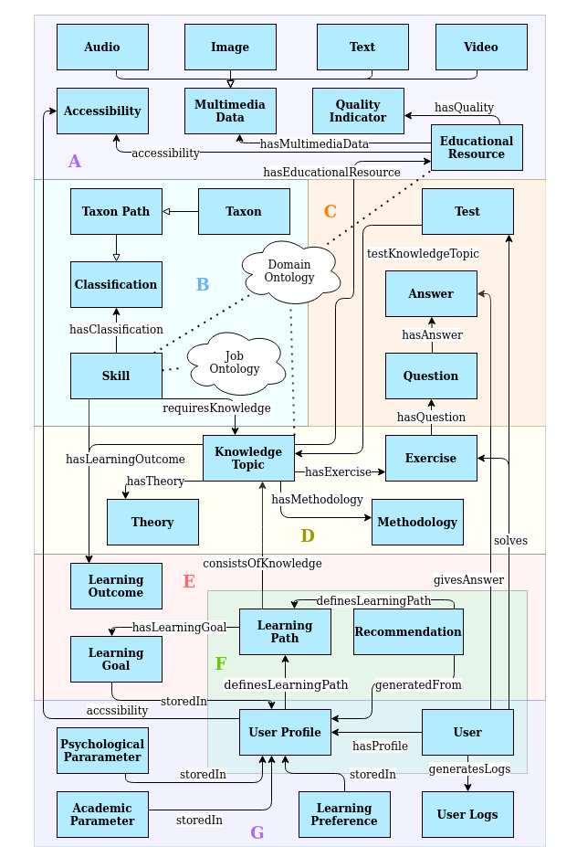

# EduCOR: An Educational and Career-Oriented Recommendation Ontology
## Context

EduCOR is an educational ontology for personalized recommendation learning systems that is based on a learning path and user profile. It represents the key components for a personalized learning system based on our requirement analysis.

## Ontology page

Our ontology page with the full documentation can be found in [http://ontology.tib.eu/educor](http://ontology.tib.eu/educor/)

## Abstract

With the increased dependence on online learning platforms and educational resource repositories, a unified representation of digital learning resources becomes  essential to support a dynamic  and  multi-source learning experience. We introduce the EduCOR ontology, an educational, career-oriented ontology  that  provides  a  foundation for representing  online  learning  resources for personalised learning systems. The ontology is designed to enable learning material repositories to offer learning path recommendations, which correspond to the user’s learning goals, academic and psychological parameters, and the labour-market skills that are achieved from the learning  path. We present the multiple patterns that compose the EduCOR ontology, highlighting its cross-domain applicability and integrability with other ontologies. A demonstration of the proposed ontology on the real-life learning platform [eDoer](edoer.eu) is discussed as a use-case. We evaluate the EduCOR ontology using both gold standard and task-based approaches. The comparison of EduCOR to three gold schemata, and its application in two use-cases, shows its coverage and adaptability to multiple OER repositories, which allows generating user-centric and labour-market oriented recommendations.


## Visualisation

You can see a visualisation of the master branch educor.ttl using [WebVOWL](http://ontology.tib.eu/educor/visualization)

This is an overview of the classes in EduCOR ontology.


Through our requirement analysis we identified the key components for our representation. These key components formulate homonym patterns. Each pattern of the ontology is highlighted individually:

A: Educational resource pattern

B: Skill Pattern

C: Knowledge topic Pattern

D: Test pattern

E: Learning path pattern

F: Recommendation Pattern

G: User profile pattern

## Use-Case

### General

An OER repository owner could utilise the EduCOR ontology to model the learning materials in their repository.
The repository serves learners through a standard search and information retrieval functionality, which is to be ready for integrating with an automatic decision-support system in the future with minimum to zero adjustments of the repository structure.

### Application Specific

We also used our ontology in specific use case, in the development of [eDoer](http://edoer.eu) platform, an open learning recommender system prototype, focusing on Data Science related jobs.

On the eDoer platform, learners can set their target job, and the system will provide them with a list of skills they need to master for that particular job. Learners are offered to select one or more of those skills and set them as learning objectives. Moreover, learners can search through other existing skills and add additional learning goals. They can also set their learning preferences (type of learning materials, the length of content, etc.), which results in personalised learning content recommendations. The generated learning path includes the target skills and the necessary knowledge topics covered for each skill. Subsequently, users receive OERs for each of the knowledge topics, which can be viewed, rated, and changed. Based on the users' feedback (i.e. ratings) on each of the recommendations, eDoer updates the users' preferences to capture any changes in user preferences. Moreover, there are various assessments available both on skill and knowledge topic levels that provide means to monitor the learning process.

You can watch a demo of eDoer here:

[](https://www.youtube.com/watch?v=5PRcUgNa7tA)

## Ontology Competency Questions

EduCOR seeks to assist OER repository owners and e-learning system designers when planning to include personalised learning features in their systems. We designed a set of competency questions to reflect the mian features of EduCOR when implelented in an elearning system.

**_Q1:   How to retrieve OERs from multiple sources for a learning goal?_**

This question represents the adaptability feature of our ontology. EduCOR has been tested against multiple ER and OER repositories. It scored more that 83% of [Recall](https://en.wikipedia.org/wiki/Precision_and_recall) value for each one of them. This means that a designer of an e-learning system will have minimum adjustments to adopt OERs from multiple sources in their system.
Retrieving the OERs from EduCOR based on a certain learningGoal is achieved through the SPARQL query:

```
PREFIX ec: <https://github.com/tibonto/educor#>
PREFIX dc: <http://purl.org/dcx/lrmi-vocabs/alignmentType/>

SELECT * 
WHERE {
    ?learningPath      ?hasLearningGoal            ?LearningGoal.
    ?learningPath      ?consistsOfKnowledge        ?knowledgeTopic.
    ?knowledgeTopic    ?hasEducationalResource     ?EducationalResource.
}
```

**_Q2:   How can a personalized OER difficulty be chosen for the user?_**

This question reflects the ability of EduCOR to personalize ER and OER recommendations for a user, based on the learning material properties. The example in this case if the difficulty level of the learning material, which corresponds to the educational level off the learner. The educationalLevel is a property of the academicParameter classe in the userProfile.
The following query retrieves the test material for an OER with a certain difficuty, based on the user's level.

```
PREFIX ec: <https://github.com/tibonto/educor#>
PREFIX dc: <http://purl.org/dcx/lrmi-vocabs/alignmentType/>

SELECT * 
WHERE {
    ?test           ?tetestKnowledgeTopic   ?knowResource.
    ?knowResource   ?difficulty             ?difficulty.
    ?user           ?solves                 ?test.
    ?user           ?hasProfile             ?userProfile.
    ?acadParam      ?storedIn               ?userProfile.
    ?acadParam      ?educationalLevel       ?currentLevel. 
}
```

**_Q3:   How to provide an OER to a user with a specific access mode?_**

This question shows EduCOR's potential in personalizing ER and OER recommendations for a user based on their requirmenets. An example or those requirement is presented in the question on the Accessibility needs of the user. Accessibility class is related to both userProfile and educationalResource classes. It can be retrieved for a user' requirement as foollows:

```
PREFIX ec: <https://github.com/tibonto/educor#>
PREFIX dc: <http://purl.org/dcx/lrmi-vocabs/alignmentType/>

SELECT * 
WHERE {
    ?userProfile            ?accessibility              ?accessibility.
    ?userProfile            ?definesLearningPath        ?learningPath.
    ?learningPath           ?consistsOfKnowledge        ?knowledgeTopic.
    ?knowledgeTopic         ?hasEducationalResource     ?EducationalResource.
    ?EducationalResource    ?accessibility              ?accessibility.
}
```

**_Q4:   How to retrieve required OERs for a certain job skill?_**

This question is meant to represent the links that EduCOR draws between OERs and the skills that can be gained from them. The Skill class is defined in EduCOR from the labour-market perspective. It is related to the educationalResource class throuh its corresponding knwoeldgeTopic.
The correcponding query:

```
PREFIX ec: <https://github.com/tibonto/educor#>
PREFIX dc: <http://purl.org/dcx/lrmi-vocabs/alignmentType/>

SELECT * 
WHERE {
    ?skill             ?requiresKnowedgeTopic      ?knowledgeTopic.
    ?knowledgeTopic    ?hasEducationalResource     ?EducationalResource.
}
```

**_Q5:   What is required to generate a personalized learning path?_**
 
This question points out that a learning recommendation that targets acmplex skill, may include mltiple educational resources or knowledge topics. The learningPath class in EduCOR offers this possibility, since it is generated from the Recommendation class and ends with the targeted knwoedgeTopic. 
The following query returns the learning paths for a certain user.

```
PREFIX ec: <https://github.com/tibonto/educor#>
PREFIX dc: <http://purl.org/dcx/lrmi-vocabs/alignmentType/>

SELECT * 
WHERE {
    ?user              ?hasProfile             ?userProfile.
    ?recommendation    ?generatedFrom          ?userProfile.
    ?recommendation    ?definesLearningPath    ?learningPath.
}
```

**_Q6:   How to personalize a learning recommendation based on a user’s psychological state?_**

This question highlights the strength of EduCOR in modelling the users. A personalized recommendation is generated to a user based on their profile. The userProfile class includes the academicParamater, psychologicalParameter, learningPreferenc and learningGoal classes, to model the behaviour, interest and intention of the user respectively. Those factors are required to personallize the OER recommendation. An example is shown in the following query, where the psychological status of the learner influences the duration of recomended exercise (e.g. recommend shorter exercises when the learner is tired).

```
PREFIX ec: <https://github.com/tibonto/educor#>
PREFIX dc: <http://purl.org/dcx/lrmi-vocabs/alignmentType/>

SELECT * 
WHERE {
    ?psychologicalParameter    ?storedIn                   ?userProfile.
    ?recommendation            ?generatedFrom              ?userProfile.
    ?recommendation            ?definesLearningPath        ?learningPath.
    ?learningPath              ?consistsOfKnowledge        ?knowledgeTopic.
    ?knowledgeTopic            ?testExercise               ?Exercise.
    ?Exercise                  ?timeRequired               ?timeRequired.    
}
```

## Tools used during development

Ontology Editor: [Protege 5.5.0](https://protege.stanford.edu/products.php#desktop-protege)
